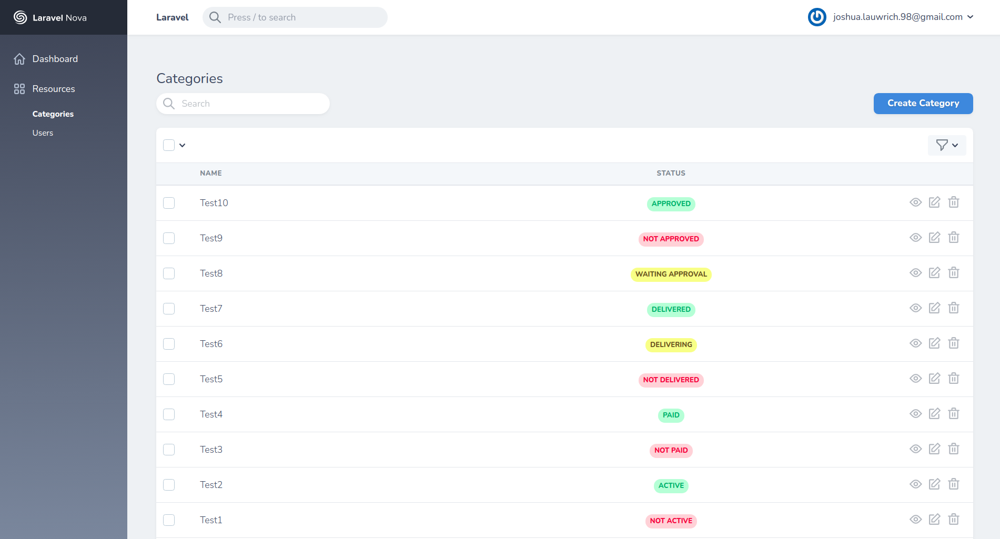
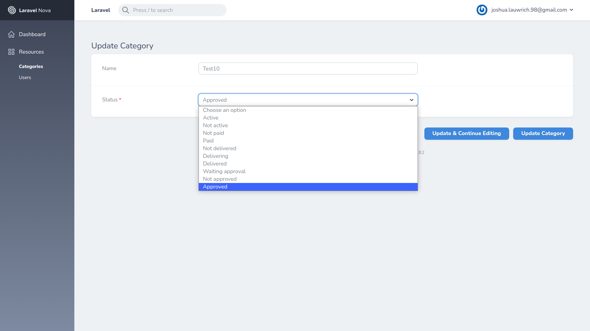
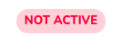

# Simple Status With Enum


Simple status indicator using badge field.

## Dependency

This package uses:

- [BenShampo/laravel-enum](https://github.com/BenSampo/laravel-enum)
- [simplesquid/nova-enum-field](https://github.com/simplesquid/nova-enum-field)

So, make sure to check out the installation instructions on those packages first.

## Installation

```shell
composer require joshua060198/nova-simple-status-with-enum
```

## Screenshot

### Index / Detail



### Edit



## Usage

1. Create your enum class and apply `MappableStatus` trait.

   ```php
   <?php

   namespace App\Enums;

   use BenSampo\Enum\Enum;
   use Joshua060198\NovaSimpleStatusWithEnum\MappableStatus;

   final class CategoryStatus extends Enum
   {
       use MappableStatus;

       const Active =   1;
       const NotActive =   0;
   }
   ```

2. `MappableStatus` trait provide a static function `getMappedStatus()` to get status mapping for css classes in `Badge` field. You can override this to your need. **Important: you need to provide all mapping to `getMappedStatus()` function!**

   ```php
   <?php

   namespace App\Enums;

   use BenSampo\Enum\Enum;
   use Joshua060198\NovaSimpleStatusWithEnum\MappableStatus;

   final class CategoryStatus extends Enum
   {
       use MappableStatus;

       const Active =   1;
       const NotActive =   0;
       const MyCustomStatus = 2;

       public static function getMappedStatus() {
           $parent = static::$defaultMappedStatus;
           $new = [
               'My Custom Status' => 'bg-success-dark text-light'
           ];

           return array_merge($parent, $new);
       }
   }
   ```

3. Apply it in resource

   ```php
   // app/Nova/Order.php

   use Joshua060198\EditableStatusCard\EditableStatusCard;

   class Category extends Resource {

       ...

       public function fields(Request $request) {

           return [
               StatusView::make($this->status, CategoryStatus::class),

               StatusForm::make(CategoryStatus::class)
           ]
       }

       ...
   }
   ```

## Constructor

### StatusForm

You need to pass the enum class that holds all of constant for your status. The next param is the same as regular nova fields.

**Example**

```php
    StatusForm::make(CategoryStatus::class, 'Custom Status', 'my_status')
```

### StatusView

There are two required params for this. The first one give the actual value for your status field, and the second one pass the enum class that holds all of constant.

**Example**

```php
    StatusView::make($this->my_custom_status, CategoryStatus::class, 'My Status')
```

## IMPORTANT!!

- This status field will split your constant variable by capital letter and displayed them with spaces. For example:

  ```php
  final class CategoryStatus extends Enum
  {
      const NotActive =   0;
  }
  ```

  will be displayed as

  

- You need to provide the mapping for your enum constant in `getMappedStatus()` function. For example, this would produce an error later:

  ```php
  final class CategoryStatus extends Enum
  {
      use MappableStatus;

      const FirstCustomStatus =   0;
      const AnotherStatus =   1;
      const Active = 2;
  }
  ```

  You have to provide the mapping for `FirstCustomStatus` and `AnotherStatus` like this code:

  ```php
  final class CategoryStatus extends Enum
  {
      use MappableStatus;

      const FirstCustomStatus =   0;
      const AnotherStatus =   1;
      const Active = 2;

      public static function getMappedStatus() {
          $parent = static::$defaultMappedStatus;
          $new = [
              'First Custom Status' => 'custom-class',
              'AnotherStatus' => 'bg-dark text-light'
          ];

          return array_merge($parent, $new);
      }
  }
  ```

- Default mapped status value are :
  ```php
  public static $defaultMappedStatus = [
    'Active' => 'bg-success-light text-success-dark',
    'Warning' => 'bg-warning-light text-warning-dark',
    'Not Active' => 'bg-danger-light text-danger-dark',
    'Approved' => 'bg-success-light text-success-dark',
    'Waiting Approval' => 'bg-warning-light text-warning-dark',
    'Not Approved' => 'bg-danger-light text-danger-dark',
    'Delivered' => 'bg-success-light text-success-dark',
    'Delivering' => 'bg-warning-light text-warning-dark',
    'Not Delivered' => 'bg-danger-light text-danger-dark',
    'Paid' => 'bg-success-light text-success-dark',
    'Not Paid' => 'bg-danger-light text-danger-dark',
  ];
  ```

## License

The [MIT](LICENSE) license.
